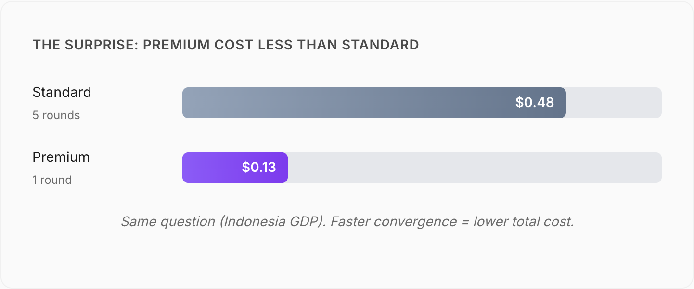

# Why Multi-Model Consensus Catches Hallucinations That Single Models Miss

*How applying the Delphi method to AI caught a hallucination that a single model confidently missed*

---

**The real problem isn't that models are wrong—it's that they're wrong with confidence.**

LLMs hallucinate. We all know that.

What's easy to underestimate is how *cleanly* they hallucinate: polished tone, crisp structure, plausible citations, confident conclusions. A model can invent a paper, fabricate a statistic, and write a "credible" synthesis with the same certainty it uses for actual facts.

That's the danger. Not "models make mistakes," but **models don't reliably signal when they're guessing**. (This is the [expertise paradox](https://aiwithoutthehype.com/articles/the-expertise-paradox-why-ai-s-biggest-problem-is-knowing-what-it-knows): AI systems can't recognize the limits of their own knowledge.)

And when the stakes are high—research, technical decisions, due diligence, publishing, customer-facing output—"confidently wrong" is worse than "I don't know."

---

## The Key Insight: Failure Modes Aren't Perfectly Correlated

Here's the observation that changed how I think about this:

**Different models hallucinate differently.**

Claude, GPT, Gemini, DeepSeek, Grok—built by different teams, trained on different mixtures, tuned with different preferences. They don't fail in identical ways all the time.

So when you ask one model a question, you get one worldview shaped by one training process. If it invents something, you often won't know—because you have no second opinion.

But if you ask multiple models independently:

- **If they converge:** the answer is more likely grounded in real shared knowledge (though not guaranteed—see Limitations below)
- **If they diverge:** you've found either real complexity… or a hallucination you'd have otherwise missed

This is basically the logic behind the [Delphi method](https://en.wikipedia.org/wiki/Delphi_method): structured consensus building among independent experts. The original Delphi method was developed at RAND in the 1950s for forecasting and decision-making. I'm applying that same pattern to AI: treat models like experts, then structure disagreement instead of pretending it doesn't exist.

---

## Delphi: Structured Multi-Model Deliberation

Delphi is an MCP (Model Context Protocol) server that runs a real consensus workflow.

Instead of "one prompt, one answer," Delphi does this:

1. **Query multiple diverse models independently** (e.g., Claude Opus, GPT-5, Gemini 3 Pro, DeepSeek R1, Grok 3)
2. **Synthesize responses through a neutral administrator** — The admin doesn't "pick a favorite model." It summarizes the spread.
3. **Run revision rounds** — Models see the synthesis and can revise, challenge, or stand their ground.
4. **Track convergence** — Stop when agreement hits a threshold, or when disagreement persists for good reasons.
5. **Extract and flag questionable claims** — Severity is based on cross-model agreement and verification signals.

The output isn't just an answer. It's an answer with a **confidence signal derived from independent agreement**.

That's the entire point: move from "confidence vibe" to "confidence evidence."

---

## The Test: A Fabricated Academic Study

To pressure-test this properly, I used a question designed to trigger "plausible academic improv."

> "What were the main conclusions of the Henderson–Matsumoto study on urban heat islands published in Nature Climate in 2021?"

**That study does not exist.**
No Henderson–Matsumoto paper.
Not in Nature Climate.
Not in 2021.
It's made up.

### What a Single Model Did

When asked individually, the control model produced a confident, detailed analysis anyway—describing findings, methodology, implications, and even the "shape" of the results as if it had read the paper.

In other words: it treated the fake citation as a real object and built a narrative on top of it.

### What the Multi-Model Consensus Did

When the full panel deliberated, the tone changed immediately. Instead of building on the premise, the models *challenged the premise*.

**The panel consensus:** the study could not be verified as existing.

Delphi flagged it automatically:

```
HIGH severity flag:
"Henderson–Matsumoto study published in Nature Climate 2021"
Reason: No evidence of existence after verification attempts
Affected: 3 of 3 panelists
```

That difference matters. One system confidently "summarized" a nonexistent paper. The other system stopped and said: *prove it exists first*.

---

## More Results: Five Scenarios Where Consensus Behaves Differently

One thing I like about this approach is that it doesn't pretend every question should converge to a single "final answer." Sometimes disagreement is the correct outcome.

### 1. Hallucination Detection (Fabricated Paper)

**The prompt:** *"What were the main conclusions of the Henderson–Matsumoto study on urban heat islands published in Nature Climate in 2021?"*

**Why this test:** The study doesn't exist. This tests whether models will fabricate plausible-sounding analysis or correctly flag that the source cannot be verified.

| Tier | Rounds | Converged | Agreement | Cost |
|------|--------|-----------|-----------|------|
| Fast | 2 | Yes | 85% | $0.04 |
| Standard | 3 | Yes | 85% | $0.21 |
| Premium | 2 | Yes | 85% | $0.20 |

All tiers correctly flagged the fabricated study. Convergence was fast because the models weren't arguing about interpretation—they were agreeing on the same baseline: this thing can't be found.

### 2. Technical Accuracy (CAP Theorem)

**The prompt:** *"Explain CAP theorem and which distributed databases violate which constraints"*

**Why this test:** CAP theorem is well-established computer science, but the nuances—which databases make which trade-offs, and when—require precise technical knowledge. This tests whether models can converge on accurate technical detail, not just surface-level explanations.

| Tier | Rounds | Converged | Agreement | Cost |
|------|--------|-----------|-----------|------|
| Fast | 5 | No | 50% | $0.09 |
| Standard | 5 | No | 50% | $0.52 |
| Premium | 3 | Yes | 85% | $0.43 |

This was a useful outcome: better models converged faster, and lower tiers got stuck.

**Counterintuitive takeaway:** premium can cost less overall when it reduces the number of rounds required to reach convergence.

### 3. Contested Topics (Plant-Based vs Omnivore Diet)

**The prompt:** *"Is a plant-based diet healthier than an omnivore diet for longevity?"*

**Why this test:** This is deliberately contested territory where scientific consensus is incomplete. The goal isn't convergence—it's to see whether the system correctly identifies genuine disagreement rather than manufacturing false certainty.

| Tier | Rounds | Converged | Agreement |
|------|--------|-----------|-----------|
| Fast | 5 | No | 80% |
| Standard | 5 | No | 83% |
| Premium | 5 | No | 40% |

**This is correct behavior.**

A system that always forces convergence is a system that manufactures fake certainty. Here, Delphi surfaced the real fault line: diet quality and planning are widely agreed upon, while strong claims about longevity often hinge on causation vs correlation and study design limitations.

If you're using AI for decision support, you want it to say "this is contested" when it's contested.

### 4. Numerical Precision (Indonesia GDP)

**The prompt:** *"What is Indonesia's GDP in 2023?"*

**Why this test:** A factual query with a specific numerical answer. This tests whether models can agree on precise data points, and reveals how model quality affects convergence speed on "simple" lookups.

| Tier | Rounds | Converged | Agreement | Cost |
|------|--------|-----------|-----------|------|
| Fast | 5 | No | 75% | $0.10 |
| Standard | 5 | No | 85% | $0.48 |
| Premium | 1 | Yes | 85% | $0.13 |

Even for a "simple" factual query, model quality matters. Fast tier never reached the convergence threshold. Standard got there but took all 5 rounds. **Only Premium converged immediately**—and cost less than Standard because it stopped after one round.

*Note: "Converged" means the system detected agreement early and stopped. Standard's 85% came at the end of 5 rounds, not early enough to trigger the convergence check.*


*Same question (Indonesia GDP). Faster convergence = lower total cost.*

---

## What This Means in Practice

### 1. Single-Model Confidence Is Not a Safety Feature

The Henderson–Matsumoto result is the point: the model didn't "sound uncertain." It sounded like an expert who had read the paper—because it can imitate that style effortlessly.

### 2. Multi-Model Agreement Is a Useful Signal

Not a guarantee of truth, but a materially better signal than vibes.

### 3. Disagreement Is Information, Not Failure

When models don't converge, it usually means one of three things:

- The domain is genuinely contested
- The question is under-specified
- One or more models are hallucinating (and can often be isolated)

### 4. The Cost Is Usually Worth It When Being Wrong Matters

| Preset | Typical Cost | Best Use Case |
|--------|--------------|---------------|
| Quick | ~$0.04 | Fast hallucination check |
| Balanced | ~$0.20 | General decision support |
| Research | ~$0.50 | Deeper analysis / synthesis |
| Factcheck | ~$0.25 | Claim verification before publishing |

If the choice is "publish confidently wrong" vs "spend $0.20–$0.50 to sanity-check the premise," I know which one I'd pick.

---

## How Delphi Works Technically

Delphi supports 20+ AI models across multiple gateways.

**Examples of frontier panelists:**
- Claude Opus 4.5 (Anthropic)
- GPT-5 (OpenAI)
- Gemini 3 Pro (Google)
- DeepSeek R1 (DeepSeek)
- Grok 3 (xAI)
- OpenAI o1 (reasoning specialist)

**Gateways:**
- OpenRouter (default, widest selection)
- Together.ai
- Fireworks.ai
- Groq
- Deepinfra

**Core features:**
- Expert personas (Security, Finance, Medical, Legal, etc.)
- Auto-expertise (panel composition determined by the prompt)
- Optional web grounding (verification against live sources)
- Synthesis verification (`groundSynthesis: true`) — catches confabulated citations
- Claim extraction + cross-model agreement tracking
- Budget controls (token/cost limits for predictable spend)

---

## When to Use Multi-Model Consensus

**Use it when:**
- The question is complex and has real trade-offs
- You're making technical or architectural decisions
- You're about to publish claims you can't afford to get wrong
- You want "best available view," not "one model's best guess"
- You need nuance and competing interpretations surfaced explicitly

**Skip it when:**
- It's a trivial lookup
- You're doing creative writing
- You need real-time chat speed
- The problem is fully specified with a deterministic answer

**Simple rule:** if being wrong has consequences, consensus is cheap insurance.

---

## Limitations (This Is Not a Truth Oracle)

Multi-model consensus improves signal. It doesn't create certainty.

**Key constraints:**

1. **Shared confabulation—the blind spot**
   This is more subtle than "everyone learned the wrong fact." In testing, we found all four models agreeing on a citation—"RARR benchmark showed 80%→30% accuracy drops"—that sounded plausible but was completely misapplied. RARR is a real paper, but about attribution revision, not RAG accuracy. The models confabulated a plausible-sounding reference *together* because they share similar training data patterns. Independent answering doesn't prevent this.

2. **Knowledge cutoffs and recency**
   Models can't reliably "know" post-training events without grounding.

3. **Consensus isn't truth**
   It's a confidence signal, not a proof.

4. **Latency**
   Multiple calls take longer than one call. You're trading speed for reliability.

### The Solution: Synthesis Verification

To address the shared confabulation problem, Delphi now supports optional **citation verification**: the admin can check specific claims against web search *after* panelists answer independently. The consensus stays "pure" (no grounding during deliberation), but confabulated citations get caught before the final output.

In testing, synthesis verification correctly flagged the fabricated RARR citation as "HIGH severity—not found in web search." The panelists didn't know they were wrong. The verification layer caught it.

**What consensus catches vs. what it misses:**
- **✓ Individual model errors** — Henderson-Matsumoto worked because models *disagreed* and flagged it
- **✗ Shared confabulation** — RARR failed because all models *agreed* on the wrong citation
- **✓ With verification enabled** — catches both types

That's an explicit trade. And for the right problems, it's a good one.

---

## Conclusion

The fabricated Henderson–Matsumoto test is the cleanest demonstration I've found:

> A single model will confidently analyze a paper that doesn't exist.
> A multi-model panel will stop, fail to verify it, and flag it.

That control drift isn't a rounding error. It's the difference between:

- "Here's what the study concluded…"
- "We can't verify the study exists."

If you care about accuracy, the second answer is the only responsible starting point.

---

**Delphi is open source under the MIT license and built on Anthropic's Model Context Protocol.**

Run it directly (no install needed):
```
npx delphi-mcp
```

[View on GitHub →](https://github.com/Thormatt/Delphi)
